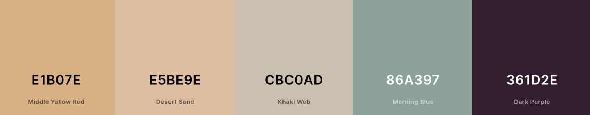

# The Cheese Shop

[Link to LIVE shop](https://the-cheese-shop-1.herokuapp.com/)

# Table of Contents:

1. [Project Goals](#1-project-goals)
2. [Project Sprints](#2-project-sprints)
3. [UX & UI](#3-user-experience)
4. [Structure](#4-structure)
5. [Features](#5-features)
6. [Marketing & SEO](#6-marketing--seo)
7. [Technologies used ](#7-technologies-used)
8. [Testing](#8-testing)
9. [Deployment](#9-deployment)
10. [Acknowledgments](#acknowledgments)

# 1. Project Goals
Build a site for customers to be able to purchase cheese and cheese accesories from. 

# 2. Project Sprints

I used an agile approach to this project by following sprints. The sprints were broken down into issues which were logged on the Github project board. [View here](https://github.com/users/angharadcaswell/projects/2/views/1)

As seen in the image below, I used a kanban board to track the progress of my tickets. 

## Sprints:
1. Set up Python, database
2. Set up base html/css and create Home app
3. Set up Authorisation for the site
4. Set up Base template
5. Set up home page
6. Create product App and views for filtering and searching. 
7. Create bag app and add CRUD functionality.
8. Build Check out app and Stripe
9. Edit admin panel 
10. Deploy
11. Marketing initative. 

# 3. User Experience

## 3.1 User Stories 

 

## 3.2 Wireframes
**The final design may have changed slightly**
### Homepage (Desktop/Mobile):

### All Products (Desktop/Mobile):

### Product View (Desktop/Mobile):

### Shopping Bag (Desktop/Mobile):

### Profile View (Desktop/Mobile):

### Product admin (Desktop/Mobile):

## 3.3 Design

### 3.3.1 Colour
I started the colour design for the site with a deep purple to represent the grapes and wine that are so often paired with cheese. I then used [Coolors](https://coolors.co/) to generate a colour pallete based on the deep purple. I particularly liked this set of colours because they are similar to the colour of cheeses and also some other neutral colours. 

I also checked the contrast of the foreground and background colours based on this pallete passed the standards of [WebAIM.](https://webaim.org/resources/contrastchecker/)

### 3.3.2 Logo
I decided upon a very simple logo so customers would know exactly what the site did. It is also a simple design so it can be used with various colors and edited for future marketing if needed. 

### 3.3.3 Font family 

Similar to the colour palette and logo I wanted to keep thing simple with the font so that the design wouldn't distract from the content of the site. 

1. Title: Imprima
2. Body: Inter

# 4. Structure
### Data Schema

### Site Map

# 5. Features

## 5.1 All features
[Current Features](features.md)

## 5.2 Features to implement:

1. Rate cheeses functionality 
2. Social logins

# 6. Marketing & SEO

## 6.1 Keyword Research:
1. I started this process by thinking about the general topics of this site. I came up with Cheese, Cheese Gifts and Cheese Accessories. 
2. I then brainstormed keywords and phrases that related to these topics. Here is an example of some of the words:

3. I then narrowed it down by assessing their relevance, authoritativeness and keyword volume. I used [word tracker](https://www.wordtracker.com/) and Google search to make these assesments. Ideally I was looking for words and phrases with high enough volume but low enough competition. 

### Low

# 7. Technologies used 
* [Python 3.2](https://en.wikipedia.org/wiki/Python_(programming_language)) - Content and structure
* [Heroku](https://id.heroku.com/login) - Host
* [Gitpod](https://www.gitpod.io/) - IDE
* [Github/ Github pages](https://github.com/)- Code repositary
* [Am I responsive?](http://ami.responsivedesign.is/#)- To see display the website as mock ups  
* [Django Alauth](https://django-allauth.readthedocs.io/en/latest/installation.html)- User athentication 
* [Bootstrap4](https://getbootstrap.com/) - UI framework
* [Font Awesome](https://fontawesome.com/) - Free Icons 
* [Figma](https://www.figma.com/) - Wireframes design
* [WebAIM.](https://webaim.org/resources/contrastchecker/) - Check color contrast 
* [Coolors](https://coolors.co/)- To create color palette. 
* [Crispy Forms](https://django-crispy-forms.readthedocs.io/en/latest/) - forms
* [Stripe](https://stripe.com/gb) - Payments
* [ElephantSQL](https://www.elephantsql.com/) - Database
* [Psycopg2](https://pypi.org/project/psycopg2/)- Supports connection to DB
* [AWS](https://aws.amazon.com/)- media and static host
* [Bulma](https://bulma.io/)0 line height of Font Awesome icons.
* [Gunicorn](https://gunicorn.org/)- server to run Django on Heroku.

# 8. Testing  
The site was tested in Gitpod terminal and Heroku by users and myself on all browsers. The site was also peer reviewed by the Code Institute community. 

## 8.1 User testing:
I tested the deployed site with several users. I asked each user to complete the following task, tell me how they did it and score it out of 5 for 

[User Stories Tested](userstories.md)

## 8.2 Bugs:
These significant bugs were found during user testing and during the build process. 

### 1. The logo was not showing in the header on any pages of the deployed site
> >#### **FIX**: *I changedthe URL in the base.html template to include the {{ MEDIA_URL }} and delete an additional slash.*     

### 2. A user noticed that the currency was inconsistent across the LIVE site.
> >#### **FIX**: *This was an easy fix, as I just needed to change the currency symbol in a couple of templates*

### 3. When I tested the deployed site on adding a product as an admin user, I recieved an error message.
> >#### **FIX**:  *Back in development, Django gave me an error that "product" did not exist. I needed to assign the variable "product" in the view.*

## 8.3 Code Validation
[Code Validation](codevalidation.md)

## 8.4 Performance testing
[Lighthouse](performance.md)

# 9. Deployment

## Github:

To start the deployment process you need to create a new repository.

1. Log into Github
2. Open [Code Institute's template](https://github.com/Code-Institute-Org/python-essentials-template)
3. Click the "Use This Template", then the "Create new repository" and add repository name.

### Forking:
1. Visit [the_cheese_shop](https://github.com/angharadcaswell/the_cheese_shop) repository.
2. Click the "Fork" button in the top right hand corner.
3. Click the "Create Fork" button

### Clone:
1. Visit [the_cheese_shop](https://github.com/angharadcaswell/the_cheese_shop) repository.
2. Press the arrow on the Code button
3. Copy the link that is shown in the drop-down and select the directory in Gitpod.
4. Use the command'git clone' in the terminal and paste the link you copied.
5. View the requirements.txt file and install all of the packages using the CLI *pip install -r requirements.txt*

### Elephant SQL:

1. Visit [elephantsql.com](elephantsql.com) and click 'Get a managed database today'. 
2. Choose free Tiny Turtle plan.
3. Select “Log in with GitHub” and authorize ElephantSQL.
4. In the Create new team form:
- Add a your own name as team name
- Read and agree to the Terms of Service.
- Select Yes for GDPR.
- Provide your email address.
- Click “Create Team”.

5. Go to dashboard, and click "Create New Instance".
6. Set up your plan:
- Add project name 
- Select the Tiny Turtleplan.
- Ignore Tags field blank.
- Click "Review" and "Create Instance".
7. Add your data through the admin panel.

## Gmail SMTP:
Gmail SMTP has been used to send order confirmations and user contact emails.
1. To use this configuration, add the following code to your settings.py file.

## Stripe:
I used Stripe to take test payments on the deployed site. 
1. Create a new Stripe account.
2. Follow the documentation on [how to set up Stripe](https://stripe.com/docs).
3. You can test your checkout app using the following test card details:

| Card number           | MM/YY | CVC | Postcode |
| ----------------------| ----- | ----| ---------|
| 4242 4242 4242 4242   | 42/42 | 424 | 42424    |

## Amazon Web Services (AWS) Storage:
All static and media files are stored with AWS S3.I have created a bucket, user group and user that can access this site and the relevant files.
1. Add the following to your setting.py file:

## Heroku:
I followed these useful [instructions](https://codeinstitute.s3.amazonaws.com/fst/Django%20Blog%20Cheat%20Sheet%20v1.pdf) by Code Institute.

1. Log in or create an account with Heroku at https://heroku.com.

2. From the Heroku dashboard, click the Create new app button.

3. On the Create New App page, enter a unique name for the application and select the region closest to you. Then click Create app.

4. Open your app page -> Settings -> "Reveal Config Vars" and add the following:
- **DISABLE_COLLECTSTATIC** 
- value = 1 *Remove this when releasing for Production.*
- **SECRET_KEY**
- value = use [Djecrety](https://djecrety.ir/) to generate a random secret key.
- **DATABASE_URL**
- value = ElephantSQL database

5. Update settings.py:
- DATABASES = {'default': dj_database_url.parse(os.environ.get('DATABASE_URL'))}
- SECRET_KEY = os.environ.get('SECRET_KEY')

6. In Gitpod,run the commands:
- *python3 manage.py migrate*
- *pip freeze > requirements.txt*
- commit and push

7. In order to be able to run the application on localhost, add SECRET_KEY and DATABASE_URL and their values to env.py

8. Connect GitHub Repo to Heroku App
- Dashboard -> select heroku app -> deploy tab -> connect with github -> deploy
- you can choose to set up automatic deployment.

## Before you deploy:
In GitPod:

1. Set DEBUG flag to False in settings.py
2. Settings -> Config Vars -> Delete environment variable : DISABLE_COLLECTSTATIC
3. Deploy : Click on deploy branch

# 10. Credits
- Pxhere: Free images [free image website](https://pxhere.com)
- Stackoverflow: [Stackoverflow](https://stackoverflow.com/)
- Wikipedia: content for product description [Wikipedia](https://en.wikipedia.org/wiki/Main_Page)
- Code Institute: This project was based on the Boutique Ado project. [Code Institute](https://codeinstitute.net/)

## Acknowledgments: 
* [Code Institute](https://codeinstitute.net/) student support, slack community and tutorials. 
* In particular, I would like to thank Rebecca and Oisin at tutor support. 
